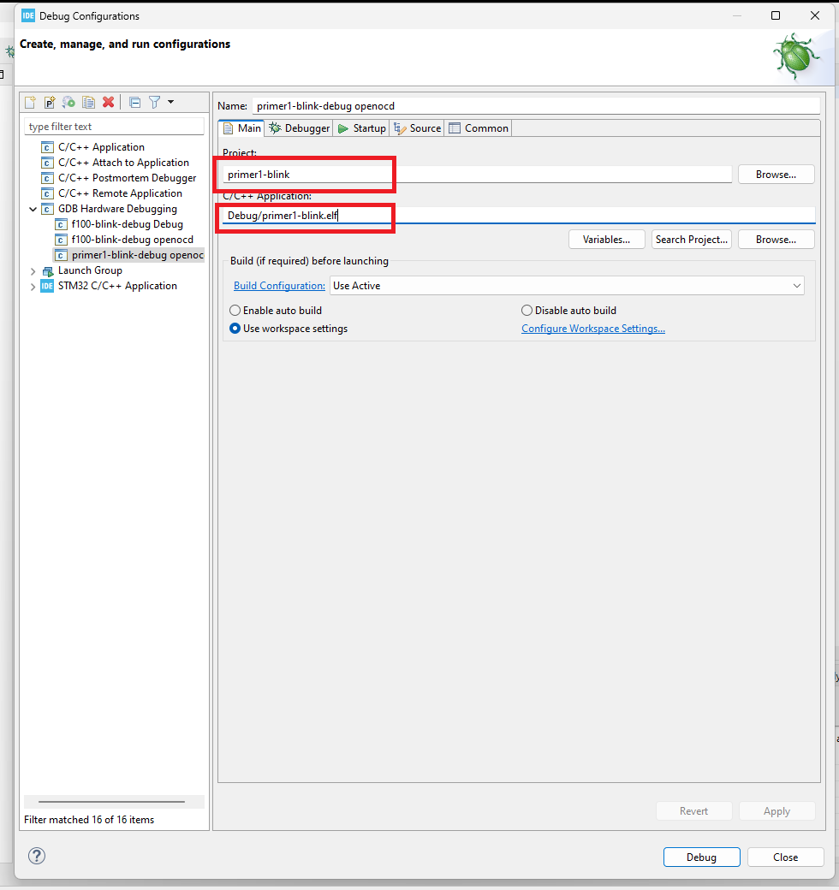

# Howto use 3rd party debuggers in STM32CubeIDE using OpenOCD

## Introduction
STM32 MCU family may be debugged using standard interfaces for ARM Cortex based devices, specifically JTAG or SWD. For JTAG and SWD there are various debugger probes which usage may be beneficial for certain users -- there may be different motivations for such, for example, communication speed, or simply user's familiarity of the tool. STM32CubeIDE by default supports only ST-Link and J-Link. Nevertheless, form certain scope, STM32CubeIDE is a tool "open for modification" and it is possible to set STM32CubeIDE with debugger probes that support OpenOCD interface. 

In this tutorial there is focus to OpenOCD compatible probes (for gdb-server compatible probes, please see the [Howto use STM32CubeIDE with ST-LINK V1 (or any other gdbserver compatible debugger]() tutorial). For the purpose of this tutorial let's assume reader is familiar with STM32CubeIDE -- knows how to set a project and how to debug it using ST-LINK V2/V3. For the purpose of this tutorial will be used **STM32 Primer 1** board that provides Raisonance R-Link JTAG interface -- as an example of 3rd party debugger (one caveat, similar board **STM32 Primer 2**, is using SWD and cannot be used with OpenOCD). 

**One additional disclaimer, please follow the license terms of the actual 3rd party debugger to avoid inconvenience.**


## Additional tools

STM32CubeIDE by default supports OpenOCD, however the version is modified (there are missing configurations for other interfaces than ST-Link and J-Link). For using with different debugger, it is necessary to obtain a "more open" version of OpenOCD, example may be [official release](https://github.com/openocd-org/openocd/releases), or [openocd-xpack](https://github.com/xpack-dev-tools/openocd-xpack) (the 2nd named will be considered here). After installation, the connection may be verified by running gdb-server form command line by (including erase of the device):

```
openocd.exe -f "..\openocd\scripts\interface\rlink.cfg" -f "..\openocd\scripts\target\stm32f1x.cfg"
```

when everything is set correctly there should be following output:

```
xPack Open On-Chip Debugger 0.12.0+dev-01850-geb6f2745b-dirty (2025-02-07-10:08)
Licensed under GNU GPL v2
For bug reports, read
        http://openocd.org/doc/doxygen/bugs.html
Info : only one transport option; autoselecting 'jtag'
Info : Listening on port 6666 for tcl connections
Info : Listening on port 4444 for telnet connections
Info : clock speed 375 kHz
Info : JTAG tap: stm32f1x.cpu tap/device found: 0x3ba00477 (mfg: 0x23b (ARM Ltd), part: 0xba00, ver: 0x3)
Info : JTAG tap: stm32f1x.bs tap/device found: 0x06410041 (mfg: 0x020 (STMicroelectronics), part: 0x6410, ver: 0x0)
Info : [stm32f1x.cpu] Cortex-M3 r1p1 processor detected
Info : [stm32f1x.cpu] target has 6 breakpoints, 4 watchpoints
Info : [stm32f1x.cpu] Examination succeed
Info : [stm32f1x.cpu] starting gdb server on 3333
Info : Listening on port 3333 for gdb connections
```

When the OpenOCD cannot found the debugger, there are probably wrongly set drivers (quite common problem). There are two ways how to resolve this, first is getting drivers from debugger manufacturer (Raisonance, in this example); second is using [Zadig tool](https://zadig.akeo.ie/) (also included in the git with project) -- Zadig is straightforward to use (it is needed to search for the R-Link device and update its driver to universal one -- according to following screenshot of result).


## Setting STM32CubeIDE

Before setting new configuration for the OpenOCD it is needed to create a firmware project for target STM32 and build it (assumed reader knows how, otherwise please see following [video](https://www.youtube.com/watch?v=Azr5vjbgACM)). When OpenOCD is set (previous step), it is needed to set CubeIDE, there needs to be set new debug configuration and set parameters (according to screenshots).

Open "Debug Configurations...":


By RMB create "New Configuration":


Add path to .elf file (project need to be successfully built before):



Set gdb command as `${gnu_tools_for_stm32_compiler_path}/arm-none-eabi-gdb.exe`, server "OpenOCD" and port (3333).


Additionally it is beneficial to set gdb-server to start with debug session (according to screenshots), firstly it is needed to open "External Tools Configurations...":


It is needed to create a "New Configuration":


The configuration needs selecting path to OpenOCD (the folder where it was downloaded to) and "Arguments:" related to debugger and the target (for Primer `-f "..\openocd\scripts\interface\rlink.cfg" -f "..\openocd\scripts\target\stm32f1x.cfg"`, another example of such may be [STM32VLDISCOVERY](https://www.st.com/en/evaluation-tools/stm32vldiscovery.html)  board (ST-LINK V1) (`-f "..\openocd\scripts\interface\stlink-hla.cfg" -f "..\openocd\scripts\target\stm32f1x.cfg"`, for example), or J-Link with STM32G474 (`-f "..\openocd\scripts\interface\jlink.cfg" -f "..\openocd\scripts\target\stm32g4x.cfg"`)):


On the "Build" tab is needed to uncheck "Build before launch" (as it was already done before):


In debug configuration it is useful to add launch configuration to connect the previous two configurations together:


By "Add..",


can be added the configurations,


and set accordingly:


Debug session may be entered by the launch configuration,


When everything correctly set, debug session should be entered and work similar to ST-LINK (attached screenshot for reference).


## Final notes

Same way to R-Link, may be used other OpenOCD compatible debuggers (list of OpenOCD adapter may be found on [web](https://openocd.org/doc/html/Debug-Adapter-Hardware.html); there may also appear similar issues with the drivers as described here). Very similar approach may be used with 3rd party tools that are gdb based (there is also previous tutorial about gdb-server in combination with legacy ST-LINK V1), this approach is described in the following article ([Howto use STM32CubeIDE with ST-LINK V1 (or any other gdbserver compatible debugger]()). 